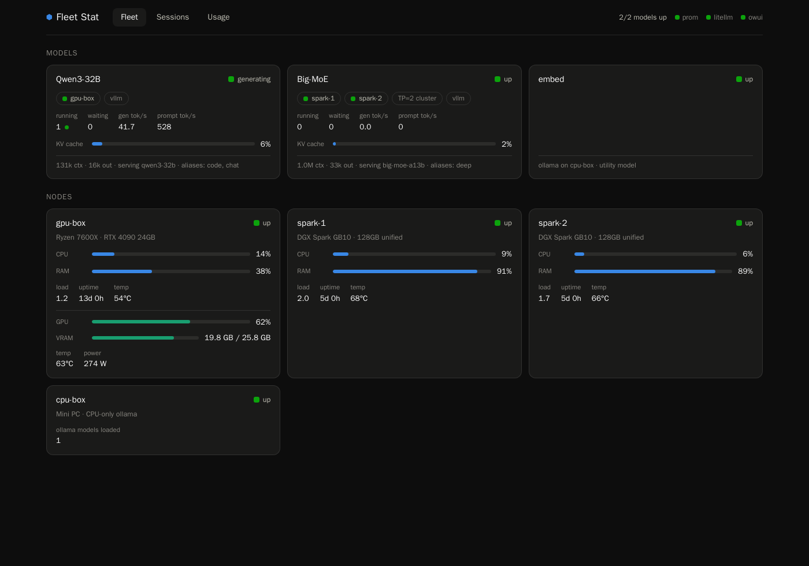

# Fleet Stat

One pane of glass for a self-hosted LLM fleet. If you run models on your own
GPUs behind a [LiteLLM](https://github.com/BerriAI/litellm) proxy and scrape
your boxes with Prometheus, Fleet Stat unifies what Grafana can't: it knows
your **topology** — which model runs on which machine, each model's context
ceiling, which hosts form a tensor-parallel cluster, and which API key or IP
belongs to which client ("harness").




Three views, one container:

- **Fleet** — every model (up/down, in-flight requests, live tok/s, KV-cache
  fill, serving host or cluster) and every node (CPU/RAM/load/uptime, GPU
  util/VRAM/temp/power, heat warnings).
- **Sessions** — every conversation across all harnesses, live, with a
  **context-fill bar** against that model's ceiling. Open WebUI chats get
  their titles and users attached.
- **Usage** — tokens, requests, and latency over time, grouped by harness or
  by model, with a totals table.

## How it works

A FastAPI backend polls three sources and serves a React dashboard:

| Source | What it provides | How |
|---|---|---|
| Prometheus | node + GPU health, vLLM live metrics | instant queries every 10s (`node_exporter`, `nvidia_gpu_exporter`, vLLM `/metrics`, optional ollama exporter) |
| LiteLLM proxy | per-request spend logs: tokens, timing, model, key, source IP | `/spend/logs/ui` + `/key/list`, incrementally, stored in its own SQLite |
| Open WebUI (optional) | chat titles/users for session enrichment | read-only copy of `webui.db` |

Sessions are reconstructed from the spend logs: requests from the same harness
and model within a 30-minute gap form a session. The context size shown is the
session's **largest** prompt+completion — chat UIs fire small title/tag
generation calls after each turn, so the newest request is usually not the
conversation. Requests are attributed to harnesses by LiteLLM virtual-key
alias first, then by requester IP.

## Quick start

Requirements: Docker, a Prometheus already scraping your nodes, and a LiteLLM
proxy with its database enabled (spend logging on).

```sh
git clone https://github.com/NickCalabs/fleet-stat
cd fleet-stat
cp config.example.yaml config.yaml   # describe YOUR fleet — this is the product
docker compose up -d --build
open http://localhost:8090
```

`config.example.yaml` documents every field: nodes (with their Prometheus
instance labels), models (host mapping, ctx ceilings, LiteLLM aliases,
cluster membership), and harnesses (key aliases / IPs, fixed chart colors).

To enrich sessions with Open WebUI chat titles, bind-mount its data directory
read-only in a `docker-compose.override.yml` (gitignored):

```yaml
services:
  fleet-stat:
    volumes:
      - /var/lib/docker/volumes/open-webui/_data:/owui:ro
```

## Security

There is no auth. The dashboard exposes usage data, chat titles, and your
config holds the LiteLLM master key — run it on a trusted LAN or behind an
authenticating reverse proxy, and keep `config.yaml` out of git (it already is).

## Development

```sh
cd frontend && npm install && npm run dev   # Vite dev server, proxies /api
FC_CONFIG=./config.yaml FC_DB=./fleet.db uvicorn backend.app:app --port 8090
```

The first LiteLLM poll backfills 30 days of spend logs; the SQLite volume is
disposable (drop it and it re-backfills).

## License

MIT
